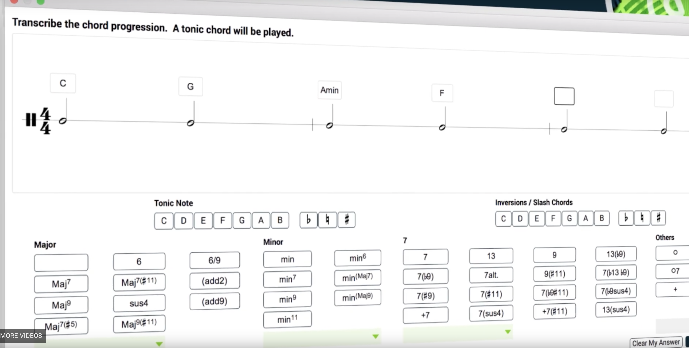
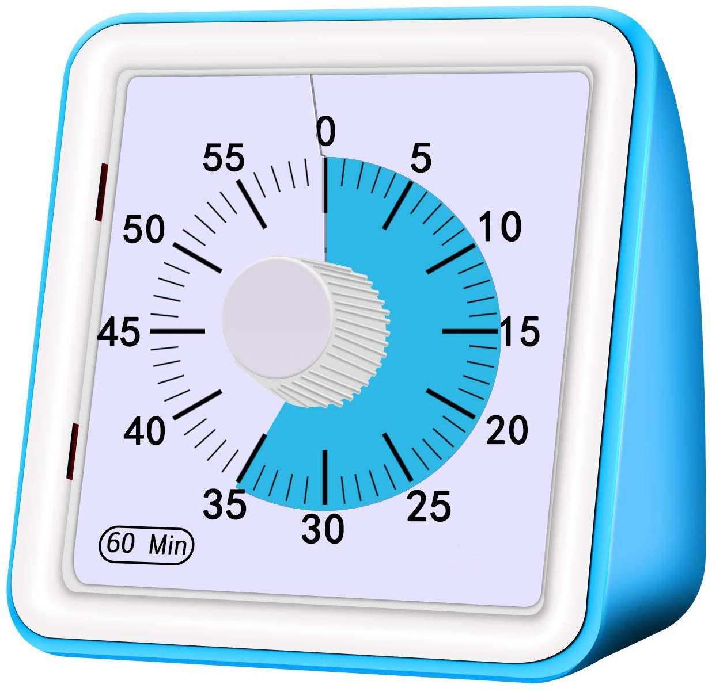
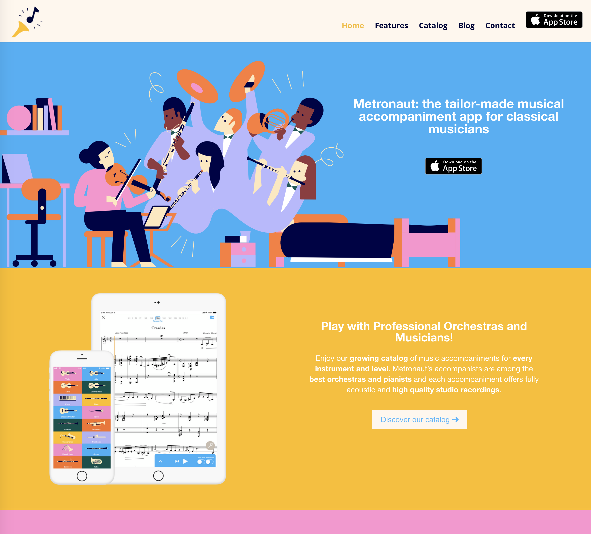
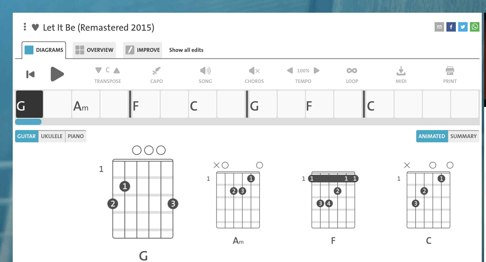
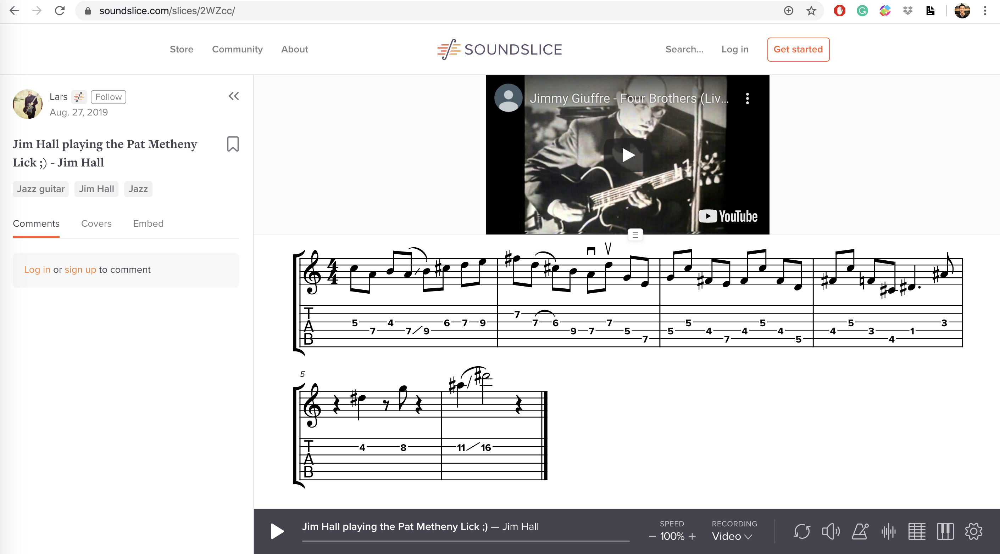

# Target Audience: Classcial Musicisian who are Struggling

The primary interface for music interaction for classical musicisians is still the sheet music

Some software in the Conservatory Academia world

Analog connection

New age software for score following:

Some for guitar player who wants to play songs by ear (transcription)

